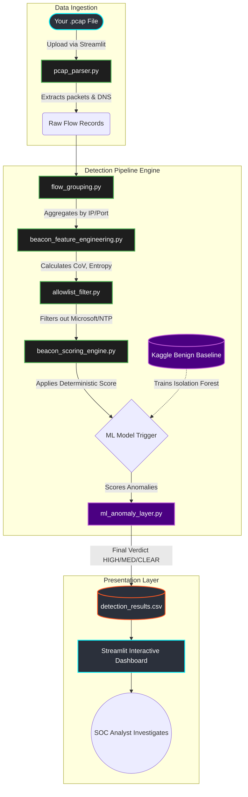

<div align="center">
  <h1>🚨 Advanced C2 Beaconing Detection Engine 🚨</h1>
  <p><strong>A Next-Generation SOC Portfolio Project for Threat Hunting & Traffic Analysis</strong></p>
</div>

---

## 📑 Table of Contents
1. [Overview & Executive Summary](#1-overview--executive-summary)
2. [What is C2 Beaconing? (The Threat Landscape)](#2-what-is-c2-beaconing)
3. [The Detection Methodology (How we catch them)](#3-the-detection-methodology)
4. [Machine Learning: The AI Anomaly Layer Explained](#4-machine-learning-the-ai-anomaly-layer-explained)
5. [System Architecture (Data Flow Diagrams)](#5-system-architecture)
6. [Deep Dive into the Source Code](#6-deep-dive-into-the-source-code)
7. [Installation & Setup](#7-installation--setup)
8. [Using the Interactive SOC Dashboard](#8-using-the-interactive-soc-dashboard)
9. [MITRE ATT&CK Framework Mappings](#9-mitre-attck-framework-mappings)

---

## 1. 🛡️ Overview & Executive Summary

Welcome to the **C2 Beaconing Detection Engine**. This tool is engineered to simulate advanced **Blue Team / Security Operations Center (SOC)** workflows. 

When attackers breach a network, they don't manually type commands all day. They install malware that automatically "phones home" to their servers to await instructions. This project analyzes raw network traffic (`.pcap` files) and uses a powerful combination of **Deterministic Mathematical Modeling** and **Unsupervised Machine Learning (Isolation Forests)** to hunt down these automated communications hidden within billions of normal packets.

This project has been highly streamlined: you no longer need to run complex Python scripts in the terminal to generate fake data. **You simply launch the visual dashboard and upload your `.pcap` files for instant, AI-driven analysis.**

---

## 2. 🕵️‍♂️ What is C2 Beaconing? 

**Command and Control (C2)** infrastructure is the lifeblood of any modern cyberattack (Ransomware, APTs, etc.).
Once a machine is infected with an agent (like *Cobalt Strike*, *Sliver*, or *Mythic*), the agent goes to "sleep" to avoid drawing attention. 

Every so often (e.g., every 60 seconds), it wakes up and reaches out to the hacker's server:
> *"Hello, I am infected Machine A. Do you have any new commands for me?"*

If the server has no commands, the agent goes back to sleep. This repeating heartbeat is called a **Beacon**.

### 🦠 The Three Types of Beacons We Detect:
1. 🔴 **Fixed-Interval Beacons**: Dumb malware. It beacons exactly every 60 seconds. Very easy to spot mathematically.
2. 🟠 **Jittered Beacons**: Advanced malware (like Cobalt Strike). The hacker sets a 60-second timer with a "20% jitter". This means it might beacon at 58 seconds, then 64 seconds, then 55 seconds. It tries to trick simple detectors.
3. 🟡 **Evasive / Long-Sleep Beacons**: The malware only beacons once every 4 hours. It's incredibly slow and blends into background noise, requiring long-term session analysis.

---

## 3. 🧮 The Detection Methodology

To catch these beacons, our engine breaks down raw packets into "Flows" (conversations between two IPs). For every flow, we extract over **24 statistical features**.

### 🔑 The Silver Bullet: Coefficient of Variation (CoV)
The single most powerful metric for catching beacons is **Timing Regularity**. We calculate the *Coefficient of Variation* of the Inter-Arrival Times (the time between each packet).
- **Formula**: `CoV = Standard Deviation / Mean`
- **Human Web Browsing**: You click a link, wait 10 seconds, click another, wait 2 minutes, read an article, wait 5 seconds. The CoV is **HIGH** (greater than 1.0) because humans are unpredictable.
- **Malware Beaconing**: An automated script reaches out every 60 seconds. Even with Jitter, the math remains tight. The CoV is **LOW** (often between 0.01 and 0.3). 

### 📡 Payload Entropy & Autocorrelation
We don't just look at time. We look at **Volume**. Beacons usually send the exact same "heartbeat" message size (e.g., exactly 250 bytes). We measure the variance in packet sizes. If a flow communicates on a rigid schedule *and* sends the exact same amount of data every time, the engine's deterministic score skyrockets.

---

## 4. 🧠 Machine Learning: The AI Anomaly Layer Explained

*You asked: "How is the ML model trained? What data does it use?"*

Deterministic rules (like "Flag if CoV < 0.3") are great, but hackers know these rules and build C2 frameworks to specifically evade them. This is where our **Machine Learning Layer** comes in.

We utilize an **Isolation Forest**—an unsupervised machine learning algorithm designed specifically for anomaly detection.

### 🏋️ How is it Trained?
Because we removed the synthetic (fake) data generators from the main pipeline to focus entirely on your uploaded PCAP files, the ML model needs to know what "Normal" internet traffic looks like *before* it can spot your malware.

1. **The Baseline Data**: We use the script `src/kaggle_baseline_loader.py`. 
2. **What it does**: When you upload a PCAP and start the analysis, this script instantly generates (or loads from Kaggle data) a robust mathematical matrix of **Benign Internet Traffic**. This baseline dataset simulates thousands of hours of normal human activity:
   - YouTube Video Streaming (High volume, bursty)
   - Reading Wikipedia (Sporadic web browsing)
   - Windows Updates (Background telemetry)
   - NTP Time Syncs (Legitimate highly-regular traffic)
3. **The Training Phase**: The **Isolation Forest** trains on this baseline data *in real-time* right before analyzing your PCAP. It learns the multi-dimensional shape of normal traffic across 11 different features (timing, bytes, duration, entropy). 
4. **The Detection Phase**: When your uploaded PCAP is processed, the flows are pushed through this trained Isolation Forest. Normal human traffic falls nicely within the learned clusters. But **Jittered Beacons**—even if their timing varies just enough to trick a human—fall drastically outside the multidimensional cluster of human behavior. The Isolation Forest isolates these anomalies and slaps them with an `ml_score` of 95+.

---

## 5. 🏛️ System Architecture

Our engine is highly modular. Here is exactly how data flows from a raw PCAP file to a visual dashboard.



---

## 6. 📁 Deep Dive into the Source Code

If you want to understand or modify the engine, here is your map to the `src/` directory.

| File | Technical Purpose & Responsibilities |
|------|--------------------------------------|
| **`pcap_parser.py`** | Uses `scapy` to rip open the uploaded PCAP file. It extracts the raw packets, tracks TCP/UDP headers, and specifically maps DNS Responses (`DNSRR`) to link IP addresses back to domain names (e.g., `evil.com`). |
| **`flow_grouping.py`** | Converts millions of individual packets into a summarized "conversation" between a source and a destination, creating macro-level flow records. |
| **`beacon_feature_engineering.py`** | The mathematical heart of the project. Uses `numpy` and `pandas` to calculate 24 features for every flow, including inter-arrival time standard deviations, bytes sent/received ratios, and off-hour connection percentages. |
| **`allowlist_filter.py`** | An expert-system rule base that automatically gives a "Pass" to traffic on port 123 (NTP) or traffic heading to known safe Microsoft/Cloudflare IP ranges, severely reducing False Positives. |
| **`beacon_scoring_engine.py`** | Uses a weighted heuristics dictionary to assign a 0-100 `deterministic_score`. Low CoV? +30 points. High Autocorrelation? +15 points. |
| **`ml_anomaly_layer.py`** | Houses the `scikit-learn` Isolation Forest architecture. It handles the baseline training data ingestion, model fitting, anomaly scoring, and generating the English-language "ML Explanations" you see in the UI. |
| **`detection_pipeline.py`** | The master orchestrator. It imports every single script listed above and chains them together sequentially, outputting the final comprehensive dataframe. |
| **`dashboard/app.py`** | The front-end. A robust Streamlit web application that provides interactive DataFrames, matplotlib Comb-Pattern charts, and Host Investigation dropdowns. |

---

## 7. 🚀 Installation & Setup

Getting the engine running on your local machine is incredibly simple.

### Prerequisites
You must have Python 3.11+ installed on your system.

### Step 1: Install Dependencies
Open your terminal and install the required Python libraries.
```bash
pip install pandas numpy scikit-learn scapy matplotlib streamlit
```

### Step 2: Start the Engine
We have created a master automation script that handles everything for you. Simply navigate to the project folder and run:
```bash
python3 run_all.py
```

*This will immediately boot up a local web server and open the Interactive Dashboard in your default web browser.*

---

## 8. 💻 Using the Interactive SOC Dashboard

Once the dashboard is open (typically at `http://localhost:8501`), here is exactly how to use it:

### The Upload Workflow
1. Look at the **left-hand sidebar** under "Upload Data".
2. Click **Browse Files** and select a `.pcap` or `.pcapng` file from your computer. (If you don't have one, you can use the test files located in `data/raw_pcap/`).
3. **Wait**. The UI will show a spinner. Behind the scenes, the engine is parsing packets, training the ML model, and scoring the traffic.
4. **Success!** The dashboard will populate with the results.

### Tab 1: Data Explorer
- You will see a massive table detailing every external IP your network talked to.
- Look at the **Final Verdict** column. `HIGH` alerts (in red) are extremely suspicious.
- Use the dropdown below the table to **Investigate a Specific Flow**. 
- The engine will generate a **Comb-Pattern Graph**. If the lines on the graph look perfectly spaced out like the teeth of a comb, you have found a C2 beacon!
- It will also print out an English explanation of exactly *why* the AI flagged it (e.g., *"interval_cov is unusually low"*).

### Tab 2: Visualizations
- View the 2D Scatter Plot. Normal traffic will be scattered wildly in the top right.
- Malicious Beacons will form a tight, terrifying cluster in the bottom left corner of the graph (representing low variance and high connection counts).

### Tab 3: Host Investigation (Threat Hunting Pivot)
- If you find a compromised machine (e.g., `10.50.1.22`), click on this tab.
- Select that internal IP from the dropdown.
- The UI will instantly show you every single DNS Domain and IP that machine contacted, allowing you to instantly identify the hacker's domain name (e.g., `sneaky-update-api.com`).

---

## 9. 🛡️ MITRE ATT&CK Framework Mappings

This project maps directly to industry-standard threat frameworks. If you are showcasing this in an interview, here are the techniques this engine neutralizes:

- 🔗 **T1071.001 - Application Layer Protocol: Web Protocols**: Detected by analyzing ports 80/443 and HTTP/HTTPS payload consistencies.
- 🔗 **T1573 - Encrypted Channel**: Because we don't rely on Deep Packet Inspection (DPI) to read the contents of the payload, this engine successfully detects malware hiding inside encrypted TLS/SSL tunnels by purely looking at the timing metadata.
- 🔗 **T1029 - Scheduled Transfer**: Detected via our Autocorrelation scoring and Isolation Forest anomaly tracking.

---
*Developed as a premier portfolio project for Advanced Network Security & Threat Hunting.*
